## Digital Khata

**Simple responsive web app to track expenses with simple data visualizations.**

For demo visit the site by [Clicking here](https://digital-khata.herokuapp.com/)

Login with
  
 email : demomail@gmail.com
password : demopassword

## Images

| Desktop                    |                              |
| -------------------------- | ---------------------------- |
| 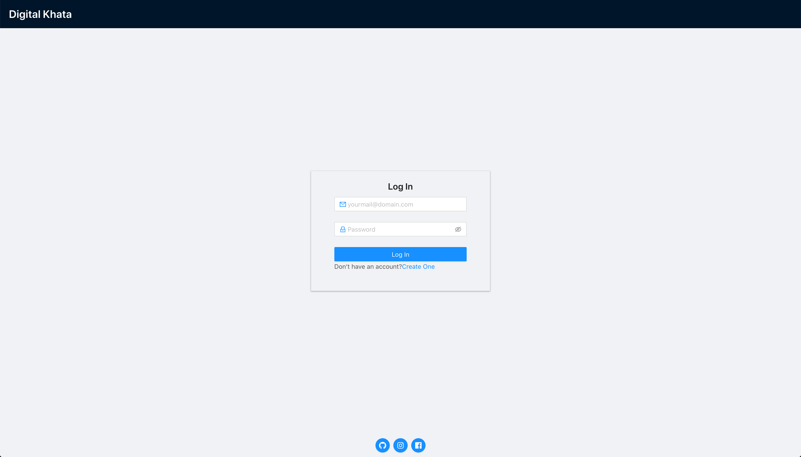      | 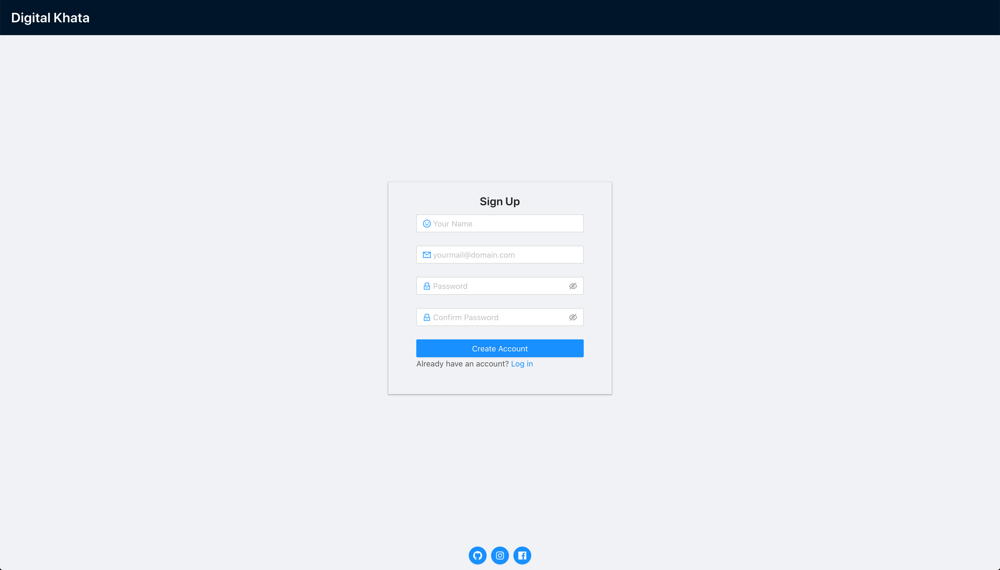       |
| 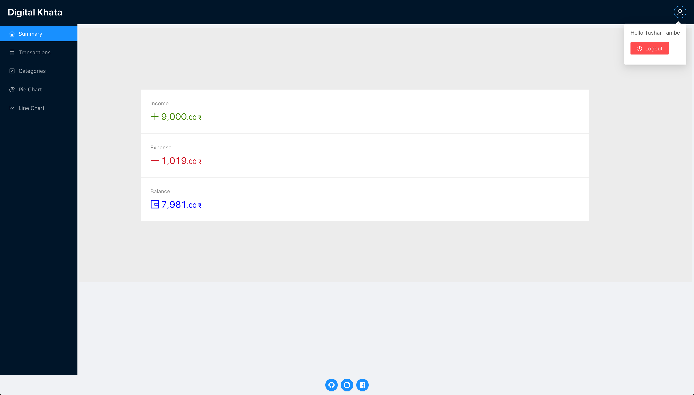    | 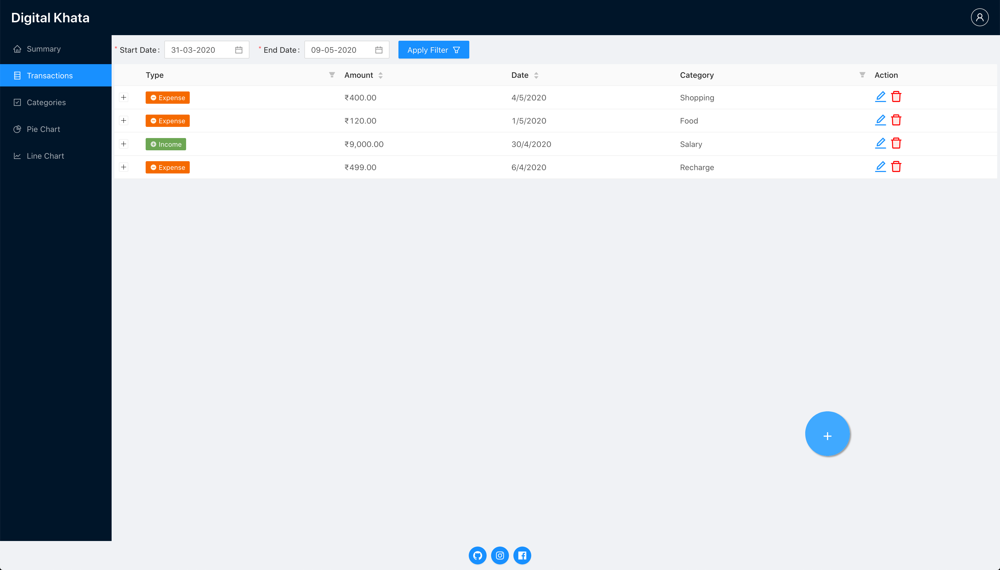 |
| 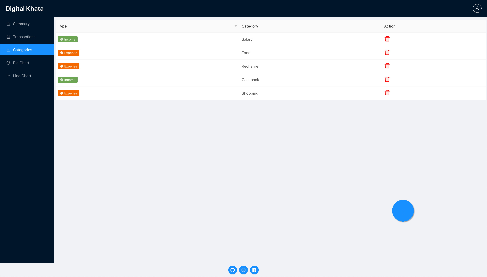 | 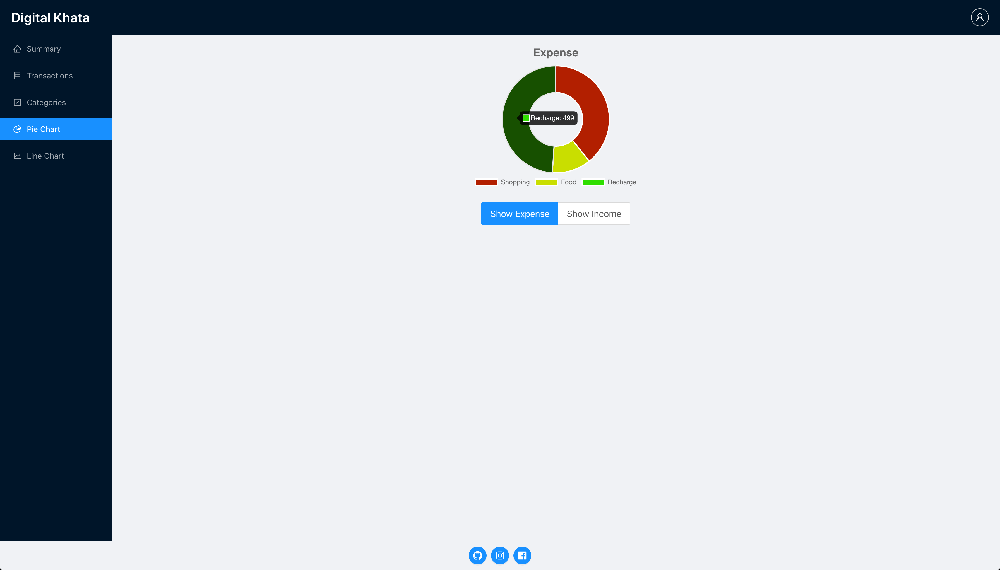          |

| Mobile                         |                                   |                                     |
| ------------------------------ | --------------------------------- | ----------------------------------- |
| 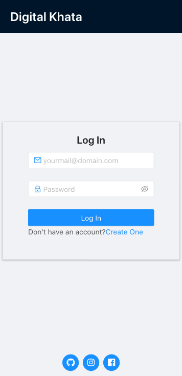   | 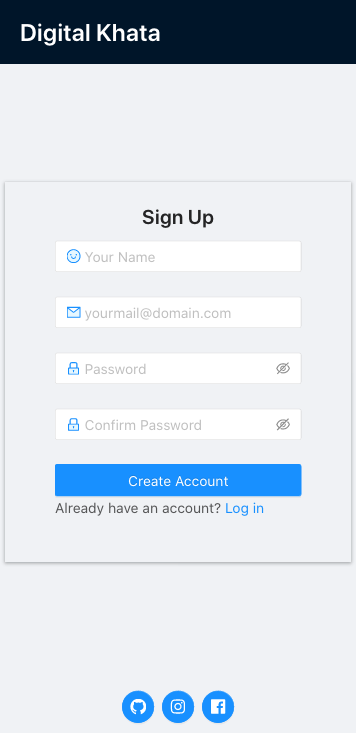     | 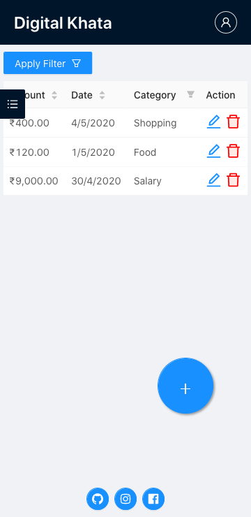 |
| 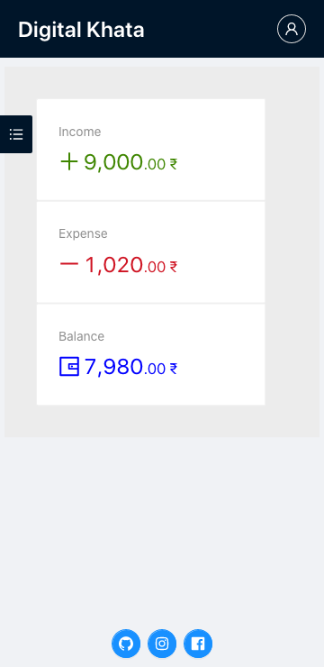 | 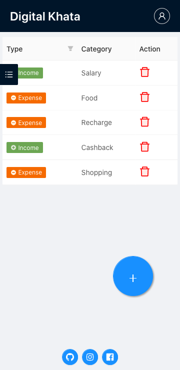 | 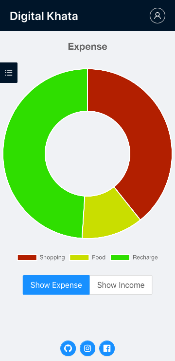          |

---

## To run this app on your local

you must have mongo,nodejs and npm installed on your machine.

#### Clone the repo.

    git clone https://github.com/tushartambe/digital-khata.git

#### Go to project and install dependencies for backend.

    cd digital-khata
    npm install

#### Set MONGO_URI env variable from terminal and start the server.

      export MONGODB_URI="mongodb://localhost/digi-khata"
      node server.js

#### Go to client folder install dependencies for frontend and start frontend.

      cd client
      npm install
      npm start

#### Your frontend will be running at <localhost:3000/>.
